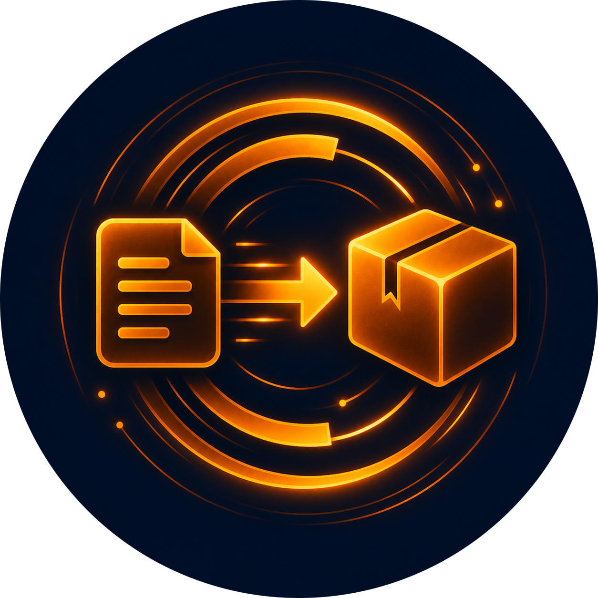

<p align="center">
  
</p>

<h1 align="center">Installable Skill Converter</h1>

<p align="center">
  
  <a href="LICENSE"></a>
  <a href="https://www.linkedin.com/in/wolfgang-muhsal-12408194/"></a>
</p>

Installable Skill Converter is an agent skill that helps convert an existing skill into an installable skill package for `npx skills add`.

It focuses on the structural work: moving skill-owned files into the proper skill subfolder, keeping the root README human-facing, adding or updating installation instructions, checking icon metadata, and validating discovery with the Skills CLI. It does not rewrite the skill's own instructions, references, scripts, or bundled knowledge unless explicitly asked.

## Installing Installable Skill Converter

Install the skill with `npx`:

```bash
npx skills add https://github.com/Gucky/InstallableSkillConverter --skill installable-skill-converter
```

To install it globally for Codex:

```bash
npx skills add https://github.com/Gucky/InstallableSkillConverter --skill installable-skill-converter --agent codex --global
```

For a specific agent:

```bash
npx skills add https://github.com/Gucky/InstallableSkillConverter --skill installable-skill-converter --agent claude-code
```

For all supported agents:

```bash
npx skills add https://github.com/Gucky/InstallableSkillConverter --skill installable-skill-converter --agent '*'
```

If `npx` is not available, install Node.js first. On macOS with Homebrew:

```bash
brew install node
```

## Using Installable Skill Converter

In Codex, trigger the skill directly:

```text
$installable-skill-converter
```

You can also ask naturally:

```text
Use the Installable Skill Converter skill to make this skill installable with npx skills add.
```

## License

Installable Skill Converter was created by [Wolfgang Muhsal](https://github.com/Gucky). It is available under the [MIT License](LICENSE), which permits commercial use, modification, distribution, and private use.
